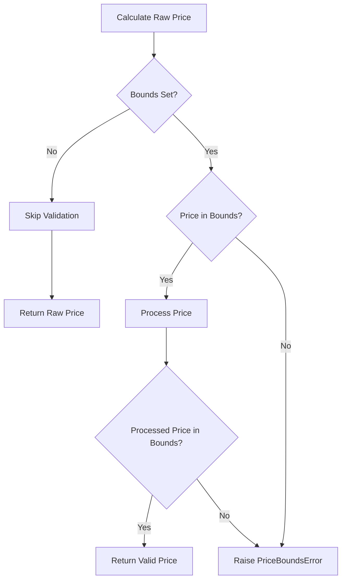

# Strategy Refactor Summary

## Overview
All pricing strategies have been refactored to inherit from a common base class with comprehensive price bounds validation and shared functionality.

## 🏗️ Architecture Changes

### BaseStrategy Class (`src/strategies/base_strategy.py`)
**New abstract base class providing common functionality for all pricing strategies:**

#### Key Features:
- **Abstract Methods**: `apply()` and `get_strategy_name()` must be implemented by subclasses
- **Price Bounds Validation**: Validates calculated prices against product min/max bounds
- **Common Utilities**: Price rounding, competitive price calculation, message generation
- **B2B Support**: Built-in methods for B2B standard and tier pricing
- **Error Handling**: Custom `PriceBoundsError` exception with detailed information

#### Core Methods:
```python
# Price validation with exception on bounds violation
validate_price_bounds(price, tier=None) -> float

# Calculate competitive price with beat_by logic  
calculate_competitive_price(competitor_price, beat_by) -> float

# Process price through NewPriceProcessor with bounds checking
process_price_with_bounds_check(raw_price, seller_id, asin, tier=None) -> float

# Apply B2B pricing strategies
apply_b2b_standard_pricing() -> None
apply_b2b_tier_pricing() -> None
```

### PriceBoundsError Exception
**Custom exception raised when calculated prices violate min/max bounds:**

```python
class PriceBoundsError(Exception):
    def __init__(self, message, calculated_price, min_price, max_price):
        self.calculated_price = calculated_price  # The invalid price
        self.min_price = min_price               # Product's minimum price
        self.max_price = max_price               # Product's maximum price
```

## 📊 Refactored Strategies

### 1. ChaseBuyBox Strategy
- **Inherits from**: `BaseStrategy`
- **Strategy Name**: `WIN_BUYBOX`
- **Functionality**: Beats competitor prices by configured amount
- **Bounds Validation**: ✅ Validates both standard and B2B tier prices
- **Error Handling**: Raises `PriceBoundsError` if calculated price is outside bounds

### 2. MaximiseProfit Strategy  
- **Inherits from**: `BaseStrategy`
- **Strategy Name**: `MAXIMISE_PROFIT`
- **Functionality**: Matches competitor prices exactly when winning buybox
- **Bounds Validation**: ✅ Validates competitor price against bounds
- **Additional Logic**: Skips if competitor price ≤ current price

### 3. OnlySeller Strategy
- **Inherits from**: `BaseStrategy` 
- **Strategy Name**: `ONLY_SELLER`
- **Functionality**: Uses default price or mean of min/max when no competition
- **Bounds Validation**: ✅ Validates both default and calculated mean prices
- **B2B Support**: Handles B2B tiers gracefully (allows None prices for some tiers)

## 🔧 Updated Integration

### RepricingEngine Changes
- **Import**: Updated to import `PriceBoundsError` from strategies module
- **Exception Handling**: Added specific handling for `PriceBoundsError` in `calculate_new_price()`
- **Logging**: Enhanced logging with price bounds violation details

```python
except PriceBoundsError as e:
    self.logger.warning(
        f"Price bounds violation: {e.message}",
        extra={
            "calculated_price": e.calculated_price,
            "min_price": e.min_price, 
            "max_price": e.max_price,
            "strategy": strategy_name
        }
    )
    return None  # Strategy fails, no price update
```

## ✅ Validation Behavior

### Price Bounds Checking
1. **Validation Triggered**: Before and after price processing
2. **Bounds Sources**: Uses `min_price`/`min` and `max_price`/`max` fields
3. **Skipping**: Automatically skips validation when bounds are `None`
4. **Exception Details**: Provides calculated price and bounds in exception

### Validation Flow


## 🧪 Demo Results
The implementation was verified with a comprehensive demo showing:

### ✅ Successful Cases
- Valid prices within bounds: **PASS**
- No bounds set (validation skipped): **PASS**
- Strategy inheritance working: **PASS**

### ❌ Error Cases  
- Price below minimum: **Properly raises PriceBoundsError**
- Price above maximum: **Properly raises PriceBoundsError**
- Detailed error information: **Available in exception**

## 📋 Benefits

### 1. **Consistency**
- All strategies follow the same inheritance pattern
- Unified error handling and logging
- Consistent price validation across strategies

### 2. **Reliability** 
- **Fail-safe**: Invalid prices cannot be applied
- **Detailed Errors**: Exceptions include calculated price and bounds
- **Graceful Degradation**: B2B tiers can fail individually

### 3. **Maintainability**
- **DRY Principle**: Common code in base class
- **Easy Extension**: New strategies inherit full functionality  
- **Centralized Logic**: Price processing logic in one place

### 4. **Observability**
- **Comprehensive Logging**: All price calculations logged
- **Error Tracking**: Price bound violations tracked separately
- **Strategy Metrics**: Processing time and success rates available

## 🔧 Configuration
No configuration changes required. The system:
- **Honors existing min/max price fields** from product data
- **Maintains backward compatibility** with existing price processing
- **Automatically skips validation** when bounds are not set
- **Works with both standard and B2B** pricing structures

## 📈 Impact on Throughput System
The refactoring **enhances the high-throughput system** by:
- **Early Validation**: Catches invalid prices before Redis storage
- **Reduced Errors**: Prevents invalid price submissions 
- **Better Monitoring**: More detailed error classification
- **Consistent Behavior**: Unified strategy behavior across all platforms

All existing pipeline components (Orchestrator, FastAPI, SQS Consumer) continue to work without changes while benefiting from improved error handling and validation.