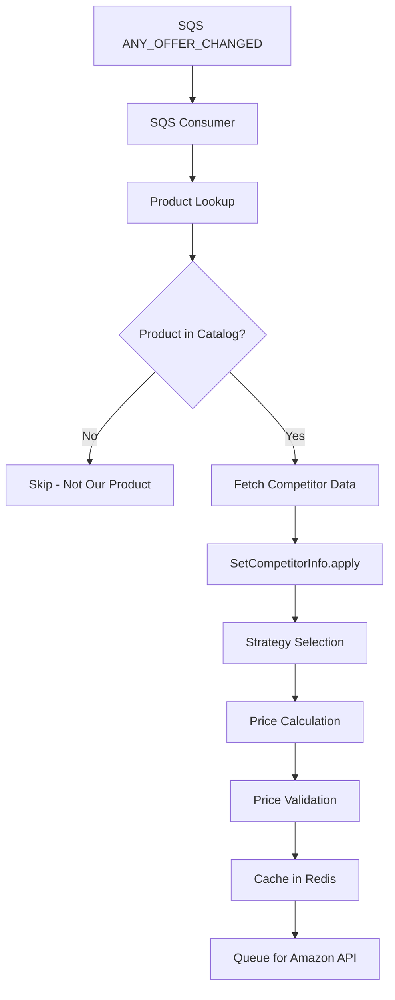
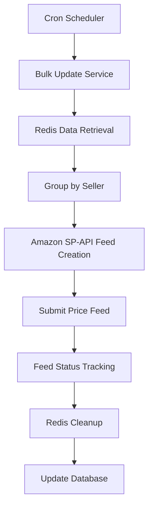
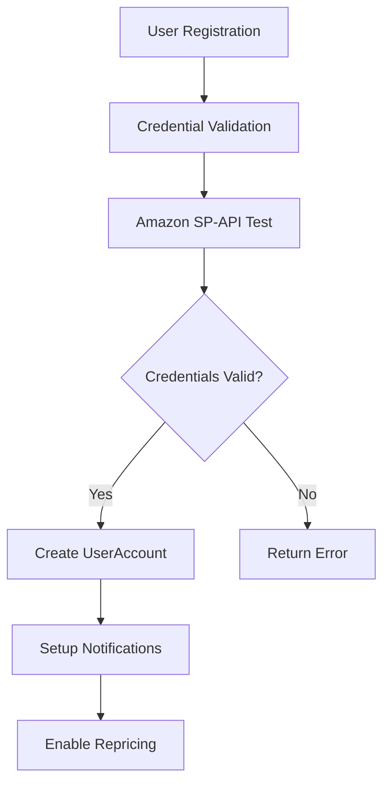
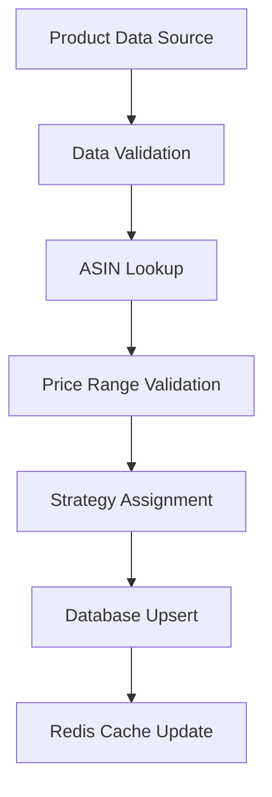
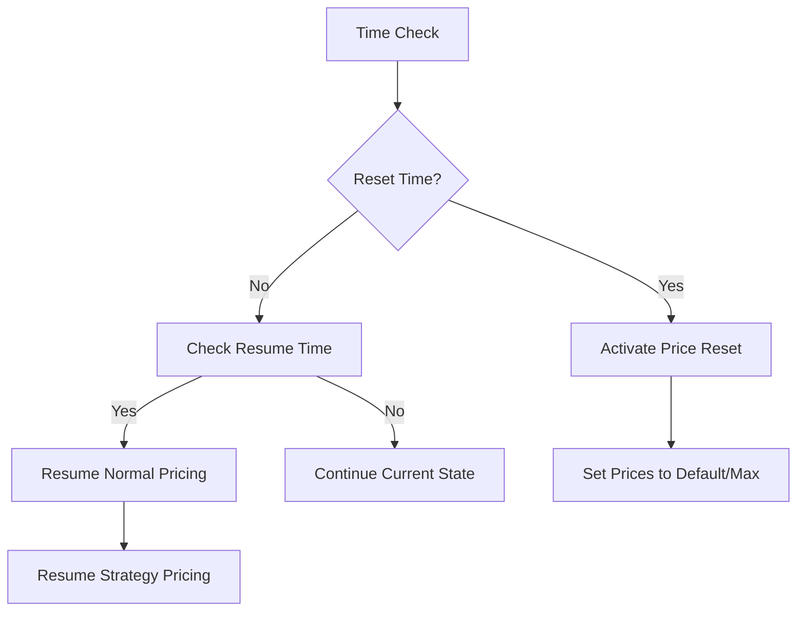
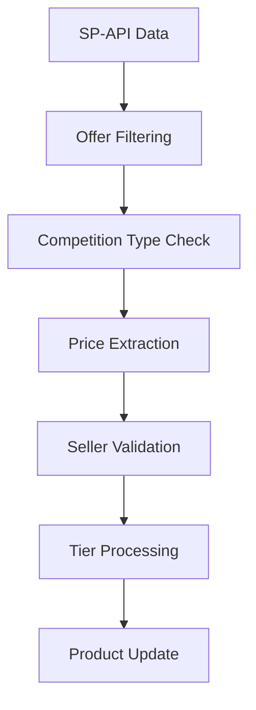
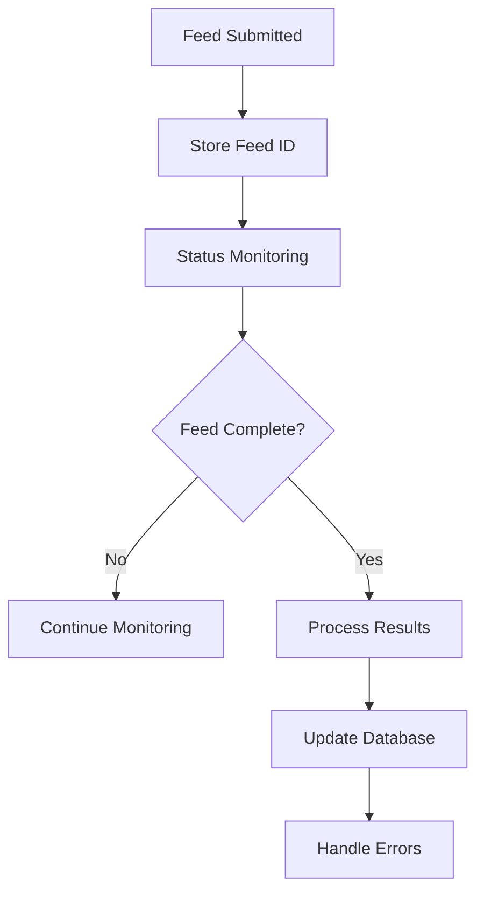

# URepricer System - Service and Data Flows Documentation

This document provides a comprehensive overview of the key business processes in the URepricer system, including service flows, data movements, and architectural patterns.

## System Overview

The URepricer system is a FastAPI-based Amazon marketplace repricing service that processes competitor data, calculates optimal prices using various strategies, and manages price updates through Amazon's SP-API. The system uses PostgreSQL for persistent storage, Redis for caching, and integrates with AWS SQS for message queuing.

## Architecture Components

### Core Services
- **FastAPI Application** (`src/main.py`) - REST API endpoints
- **Strategy Engine** (`src/strategies/`) - Pricing strategy implementations  
- **Price Processor** (`src/strategies/new_price_processor.py`) - Price validation and rules
- **Competitor Analysis** (`src/tasks/set_competitor_info.py`) - Competition data processing
- **Product Service** (`src/services/update_product_service.py`) - Amazon API integration

### Data Storage
- **PostgreSQL** - Persistent storage for accounts, listings, pricing history
- **Redis** - Cache for repriced products, temporary data storage
- **SQS** - Message queuing for price change notifications

### External Integrations  
- **Amazon SP-API** - Product data retrieval and price updates
- **AWS SQS** - Price change notifications (ANY_OFFER_CHANGED)
- **Kafka** - Optional external notifications

---

## 1. Price Change Processing Flow

**Description**: Core flow triggered by Amazon ANY_OFFER_CHANGED notifications when competitor prices change.

### Trigger
- Amazon SQS message received on `SQS_QUEUE_URL_ANY_OFFER` queue
- Message contains ASIN, marketplace, and competitor offer changes
- Triggered by ANY_OFFER_CHANGED subscription events

### Service Flow



### Data Flow

1. **SQS Message Reception**
   - **Input**: JSON message with ASIN, marketplace, seller info
   - **Service**: `any_offer_consumer.py` (from test references)
   - **Processing**: Parse message, validate ASIN

2. **Product Catalog Check**
   - **Service**: `ProductListing` model query
   - **Storage**: PostgreSQL `product_listings` table
   - **Query**: `SELECT * FROM product_listings WHERE asin = ? AND seller_id = ?`

3. **Competitor Data Processing**
   - **Service**: `SetCompetitorInfo` class
   - **Input**: Amazon SP-API payload with competitor offers
   - **Processing**: 
     - Filter offers by condition and fulfillment type
     - Set competitor prices for standard and B2B tiers
     - Determine buybox winner status

4. **Strategy Application**
   - **Service**: `ApplyStrategyService`
   - **Logic**: 
     ```python
     if product.no_of_offers == 1:
         strategy_type = 'ONLY_SELLER'
     elif not product.is_b2b and product.is_seller_buybox_winner:
         strategy_type = 'MAXIMISE_PROFIT'  
     else:
         strategy_type = 'WIN_BUYBOX'
     ```

5. **Price Calculation**
   - **Service**: Strategy classes (`ChaseBuyBox`, `MaximiseProfit`, `OnlySeller`)
   - **Processing**: Calculate new price using `eval(f"{competitor_price} + {beat_by}")`
   - **Validation**: `NewPriceProcessor.process_price()`

6. **Redis Caching**
   - **Service**: `AmazonProductPrice._save_data_in_redis()`
   - **Key Pattern**: `{seller_id}_repriced_products`  
   - **Data Structure**: Hash with SKU as field, pricing data as value
   - **Content**:
     ```json
     {
       "asin": "B08F2QH222",
       "sku": "SKU123", 
       "seller_id": "A1B2C3D4E5F6G7",
       "Standard": {
         "updated_price": 15.99,
         "listed_price": 16.99
       }
     }
     ```

### Key Components
- **SetCompetitorInfo**: Competitor analysis and price extraction
- **ApplyStrategyService**: Strategy selection logic
- **ChaseBuyBox/MaximiseProfit/OnlySeller**: Strategy implementations
- **NewPriceProcessor**: Price validation and rule application
- **AmazonProductPrice**: Redis caching and API preparation

### Storage
- **PostgreSQL**: Product listings, user accounts, competitor history
- **Redis**: Cached repricing data for bulk Amazon API calls
- **SQS**: Message queuing for notifications

### Output
- New calculated price cached in Redis
- Product updated with new pricing strategy
- Ready for bulk submission to Amazon SP-API

---

## 2. Bulk Price Update Process (Amazon API Submission)

**Description**: Batch process that sends accumulated price changes to Amazon SP-API.

### Trigger  
- Scheduled cron job (typically every 5-15 minutes)
- Manual API trigger via `/repricing/bulk-update` endpoint

### Service Flow



### Data Flow

1. **Redis Data Collection**
   - **Keys**: `{seller_id}_repriced_products` 
   - **Service**: Redis client `HGETALL` operations
   - **Processing**: Collect all pending price updates per seller

2. **Feed Preparation**
   - **Service**: Amazon SP-API Feed API
   - **Format**: XML feed with price updates
   - **Structure**:
     ```xml
     <AmazonEnvelope>
       <Message>
         <MessageID>1</MessageID>
         <OperationType>Update</OperationType>
         <Price>
           <SKU>SKU123</SKU>
           <StandardPrice currency="USD">15.99</StandardPrice>
         </Price>
       </Message>
     </AmazonEnvelope>
     ```

3. **Feed Submission**
   - **API**: Amazon SP-API Feeds endpoint
   - **Method**: POST with multipart/form-data
   - **Response**: Feed submission ID for tracking

4. **Status Tracking**  
   - **Storage**: Database feed tracking table
   - **Monitoring**: Periodic status checks via SP-API
   - **States**: SUBMITTED → IN_PROGRESS → DONE/CANCELLED

5. **Cleanup**
   - **Redis**: Delete processed entries from `{seller_id}_repriced_products`
   - **Database**: Update `last_price_update` timestamp

### Key Components
- **Feed Builder**: XML generation for Amazon SP-API
- **SP-API Client**: Amazon marketplace API integration  
- **Feed Status Monitor**: Async tracking of feed processing

### Storage
- **Redis**: `{seller_id}_repriced_products` - removed after processing
- **PostgreSQL**: Feed tracking, submission history

### Output
- Price updates submitted to Amazon
- Database updated with submission status
- Redis cleared of processed entries

---

## 3. User Account and Credentials Management

**Description**: User onboarding, Amazon SP-API credential validation, and account management.

### Trigger
- New user registration via `/accounts/register` endpoint
- Credential updates via `/accounts/{seller_id}/credentials` endpoint
- Periodic credential validation (cron job)

### Service Flow



### Data Flow

1. **Registration Request**
   - **Input**: Seller ID, marketplace, refresh token
   - **Validation**: Required fields, marketplace type
   - **Schema**: `AccountCreate` Pydantic model

2. **Credential Validation**
   - **Service**: Amazon SP-API authentication
   - **Test Call**: GetMarketplaceParticipations or similar
   - **Storage**: Temporary credential validation

3. **Account Creation**
   - **Service**: `UserAccount` model creation
   - **Database**: Insert into `user_accounts` table
   - **Fields**:
     ```sql
     INSERT INTO user_accounts (
       user_id, seller_id, marketplace_type,
       refresh_token, enabled, repricer_enabled
     ) VALUES (?, ?, ?, ?, TRUE, TRUE)
     ```

4. **Notification Setup**
   - **Service**: Amazon SP-API Notifications
   - **Subscriptions**: 
     - ANY_OFFER_CHANGED for price monitoring
     - FEED_PROCESSING_FINISHED for feed status
   - **Storage**: Subscription IDs in user account

5. **Price Reset Configuration**
   - **Service**: Optional `PriceReset` configuration
   - **Storage**: `price_resets` table with time intervals

### Key Components
- **UserAccount**: SQLAlchemy model for account data
- **SP-API Client**: Credential validation and API testing
- **Notification Manager**: Subscription setup for SQS events

### Storage
- **PostgreSQL**: 
  - `user_accounts` table - account information
  - `price_resets` table - scheduled price management
- **Redis**: 
  - `account.{seller_id}` - cached account settings

### Output
- Validated user account with active credentials  
- SQS notification subscriptions established
- Repricing enabled for user's products

---

## 4. Catalog Update Process

**Description**: Adding and updating product listings in the system catalog.

### Trigger
- Manual product import via `/listings/import` endpoint
- Automatic sync with Amazon SP-API inventory
- CSV upload via `/listings/bulk-import` endpoint

### Service Flow



### Data Flow

1. **Product Data Input**
   - **Sources**: CSV upload, API call, Amazon inventory sync
   - **Schema**: `ProductListingCreate` validation
   - **Required Fields**: ASIN, SKU, seller_id, marketplace_type

2. **Product Validation**
   - **Service**: Amazon SP-API Product Lookup
   - **Verification**: ASIN exists, seller has listing
   - **Enrichment**: Product title, condition, category

3. **Price Configuration**
   - **Input**: Min price, max price, default price
   - **Validation**: Min < Max, positive values
   - **Defaults**: System-wide min/max if not provided

4. **Strategy Assignment**
   - **Default**: LOWEST_PRICE competition
   - **Customization**: Per-product strategy override
   - **Validation**: Strategy exists and is enabled

5. **Database Storage**
   - **Service**: `ProductListing` model upsert
   - **Operation**: 
     ```sql
     INSERT INTO product_listings (asin, sku, seller_id, ...)
     ON CONFLICT (asin, seller_id) DO UPDATE SET ...
     ```

6. **Cache Initialization**
   - **Redis Key**: `{asin}:{seller_id}` 
   - **Data**: Basic product info for fast lookup
   - **TTL**: 24 hours for automatic refresh

### Key Components
- **ProductListing**: SQLAlchemy model for product data
- **Product Validator**: Amazon SP-API integration for verification
- **Strategy Assigner**: Default strategy logic

### Storage
- **PostgreSQL**: `product_listings` table - permanent product catalog
- **Redis**: `{asin}:{seller_id}` - cached product lookups

### Output
- Product added to active repricing catalog
- Ready for competitor monitoring and price calculations
- Available for strategy application

---

## 5. Price Reset Process

**Description**: Scheduled price resets during specified time intervals (e.g., overnight).

### Trigger
- Scheduled cron job based on `PriceReset.reset_time`
- Manual trigger via `/repricing/price-reset/{seller_id}` endpoint
- Time-based automation: check every hour if reset should activate

### Service Flow  



### Data Flow

1. **Time Validation**
   - **Service**: `PriceResetService.is_outside_interval()`
   - **Logic**: Check current hour against reset/resume times
   - **Handling**: Supports midnight crossing intervals

2. **Reset Activation**
   - **Query**: Active users with price reset enabled
   - **Processing**: 
     ```python
     process_redis_data("process_key_for_listed_price", 
                       [seller_id], "trigger_price_reset_time")
     ```

3. **Price Calculation**
   - **Logic**: Use max_price if available, otherwise calculated default
   - **Formula**: `min_price * 1.15` if max_price not set
   - **Validation**: Ensure price is within bounds

4. **Redis Update**
   - **Key Pattern**: `{asin}:{seller_id}_test`
   - **Value**: Reset price value  
   - **Processing**: Same as normal price update flow

5. **Resume Processing**
   - **Trigger**: When current time hits `resume_time`
   - **Action**: Remove reset state, restore normal strategy pricing
   - **Data**: Clear temporary reset flags

### Key Components
- **PriceResetService**: Time interval logic and reset coordination
- **Redis Processing**: Bulk price reset operations
- **Time Zone Handling**: Marketplace-specific time zones

### Storage
- **PostgreSQL**: 
  - `price_resets` table - reset configuration
  - `user_accounts.price_reset_id` - association
- **Redis**: 
  - `{asin}:{seller_id}_test` - temporary reset prices
  - Normal pricing keys for resume state

### Output
- Prices set to maximum/default during reset period
- Automatic resume to competitive pricing
- User accounts maintain reset state tracking

---

## 6. Competitor Analysis Process

**Description**: Processing Amazon marketplace data to identify competitors and extract pricing information.

### Trigger
- ANY_OFFER_CHANGED SQS messages
- Manual competitor refresh via API
- Scheduled competitor data updates (hourly)

### Service Flow



### Data Flow

1. **Raw Competitor Data**
   - **Source**: Amazon SP-API GetCompetitivePricing or Offers API
   - **Structure**: JSON with offers array, summary data
   - **Content**: Seller IDs, prices, conditions, fulfillment types

2. **Offer Filtering**
   - **Service**: `SetCompetitorInfo._filter_compete_with_offers()`
   - **Strategies**:
     - **LOWEST_FBA_PRICE**: FBA offers matching product condition
     - **LOWEST_PRICE**: All offers sorted by price  
     - **MATCH_BUYBOX**: Current buybox winner
   - **Processing**: Filter by condition, fulfillment, sort by price

3. **Competitor Validation**
   - **Check**: Exclude own seller ID from competition
   - **Fallback**: Use second-lowest if seller is lowest
   - **Exception**: Skip if no valid competitors found

4. **B2B Tier Processing**
   - **Data**: Quantity tiers from API response
   - **Matching**: Map competitor tiers to product tiers
   - **Update**: Set competitor prices per tier

5. **Product State Update**
   - **Fields**: `competitor_price`, `is_seller_buybox_winner`
   - **Validation**: Price > 0, seller ID format
   - **Storage**: In-memory product object for strategy processing

### Key Components
- **SetCompetitorInfo**: Main competitor analysis logic
- **Offer Filtering**: Strategy-specific competitor selection
- **B2B Tier Matching**: Multi-tier pricing support

### Storage
- **Memory**: Product object during processing
- **PostgreSQL**: `competitor_data` table for historical tracking
- **Redis**: Cached competitor data for performance

### Output
- Product enriched with competitor pricing data
- Ready for strategy-based price calculation
- Historical competitor data stored for analysis

---

## 7. Feed Processing and Status Tracking

**Description**: Managing Amazon feed submissions and monitoring processing status.

### Trigger
- Feed submission completion (from bulk price update)
- FEED_PROCESSING_FINISHED SQS notification
- Periodic status check cron job

### Service Flow



### Data Flow

1. **Feed Tracking Creation**
   - **Input**: Feed submission ID from Amazon SP-API
   - **Storage**: Feed tracking table with status
   - **Fields**: feed_id, seller_id, submission_time, status

2. **Status Monitoring**
   - **API**: Amazon SP-API GetFeed endpoint
   - **Frequency**: Every 5 minutes for active feeds
   - **States**: SUBMITTED → IN_PROGRESS → DONE/CANCELLED

3. **Result Processing**
   - **Success**: Update product prices in database
   - **Errors**: Parse error report, create alerts
   - **Report**: Download and process feed processing report

4. **Database Updates**
   - **Success Path**: Update `product_listings.last_price_update`
   - **Error Path**: Create entries in `listing_alerts` table
   - **Cleanup**: Mark feed as processed

### Key Components
- **Feed Status Monitor**: Async feed tracking service
- **Error Report Parser**: Amazon feed error handling
- **Alert Generator**: Issue notification creation

### Storage
- **PostgreSQL**: 
  - Feed tracking table
  - `listing_alerts` for issues
  - Updated product prices
- **SQS**: FEED_PROCESSING_FINISHED notifications

### Output
- Confirmed price updates in Amazon marketplace
- Error alerts for failed price changes
- Updated product catalog with actual prices

---

## System Integration Points

### Amazon SP-API Integration
- **Authentication**: Refresh token-based with automatic renewal
- **Rate Limiting**: Built-in throttling for API calls
- **Error Handling**: Retry logic for temporary failures

### SQS Message Processing
- **Queues**: 
  - ANY_OFFER_CHANGED for competitor updates
  - FEED_PROCESSING_FINISHED for feed status
- **Processing**: Batch message consumption with acknowledgment
- **Dead Letter Queue**: Failed message handling

### Redis Caching Strategy
- **Price Data**: `{seller_id}_repriced_products` for bulk operations
- **Product Lookup**: `{asin}:{seller_id}` for quick access
- **Account Data**: `account.{seller_id}` for settings
- **TTL Management**: Automatic expiration for stale data

### Database Design
- **Partitioning**: Large tables partitioned by marketplace/date
- **Indexing**: Optimized for ASIN, seller_id lookups
- **Audit Trail**: Comprehensive change tracking

## Performance Considerations

### Scalability
- **Horizontal**: Multiple API instances behind load balancer
- **Processing**: Async task processing with Celery
- **Caching**: Redis cluster for high availability

### Monitoring
- **Metrics**: Price change frequency, API response times
- **Alerts**: Failed API calls, price validation errors
- **Logging**: Structured logging with correlation IDs

### Error Handling
- **Graceful Degradation**: Continue processing when non-critical services fail
- **Circuit Breakers**: Prevent cascade failures
- **Retry Logic**: Exponential backoff for temporary failures

---

This documentation provides a comprehensive view of the URepricer system's business processes, enabling developers to understand the complete flow from competitor price changes to Amazon marketplace updates.