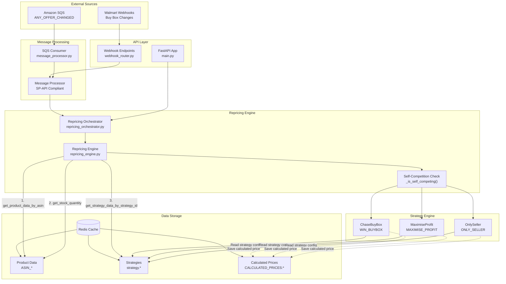
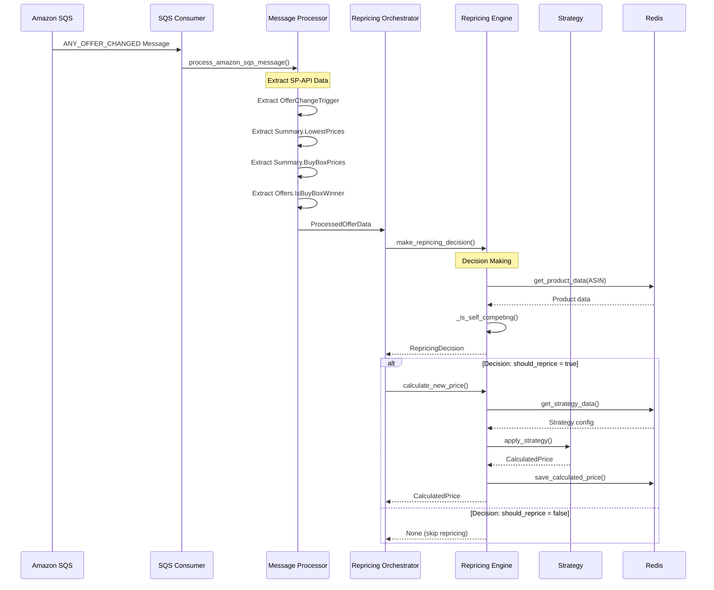
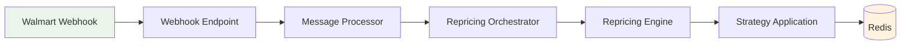
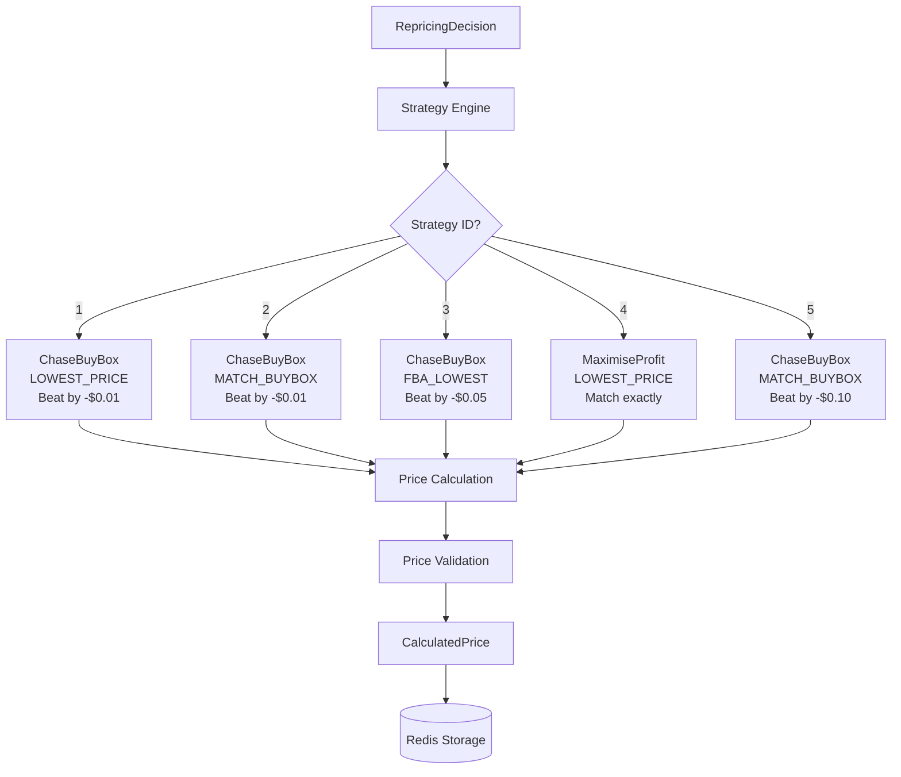

# URepricer System - Service and Data Flows Documentation

This document provides a comprehensive overview of the repricing system architecture, data flows, and processing pipeline with current implementation details.

## System Architecture Overview

The URepricer system is a FastAPI-based Amazon marketplace repricing service that processes competitor data from multiple sources, makes intelligent repricing decisions, and calculates optimal prices using configurable strategies.

### Key Components

- **FastAPI Application** - REST API and webhook endpoints
- **Message Processing** - Amazon SQS and Walmart webhook processing  
- **Repricing Engine** - Decision making and self-competition prevention
- **Strategy Engine** - Multiple pricing strategies (ChaseBuyBox, MaximiseProfit, OnlySeller)
- **Redis Cache** - Product data, strategies, and calculated prices storage
- **LocalStack** - AWS services emulation for development

---

## Core Data Flow Architecture



---

## 1. Amazon SQS Message Processing Flow

### Input: SP-API Compliant ANY_OFFER_CHANGED Notification

```json
{
  "NotificationType": "ANY_OFFER_CHANGED",
  "Payload": {
    "OfferChangeTrigger": {
      "MarketplaceId": "ATVPDKIKX0DER",
      "ASIN": "B01234567890",
      "ItemCondition": "New",
      "TimeOfOfferChange": "2025-01-01T00:00:00.000Z"
    },
    "Summary": {
      "LowestPrices": [
        {
          "Condition": "New",
          "FulfillmentChannel": "Amazon",
          "ListingPrice": {"Amount": 25.00, "CurrencyCode": "USD"}
        }
      ],
      "BuyBoxPrices": [
        {
          "Condition": "New", 
          "ListingPrice": {"Amount": 26.50, "CurrencyCode": "USD"}
        }
      ]
    },
    "Offers": [
      {
        "SellerId": "A2345678901234",
        "ListingPrice": {"Amount": 25.00, "CurrencyCode": "USD"},
        "IsBuyBoxWinner": false
      }
    ]
  }
}
```

### Processing Pipeline



### Data Extraction Methods

**MessageProcessor._extract_competitor_price()**
- Reads `Summary.LowestPrices[]` for condition match
- Prefers `LandedPrice.Amount` over `ListingPrice.Amount`
- Falls back to `Summary.BuyBoxPrices[]` if needed

**MessageProcessor._extract_buybox_winner()**
- Scans `Offers[]` for `IsBuyBoxWinner: true`
- Returns winning `SellerId`

**MessageProcessor._extract_total_offers()**
- Sums `Summary.NumberOfOffers[].OfferCount`

---

## 2. Walmart Webhook Processing Flow

### Input: Walmart Buy Box Change Webhook

```json
{
  "eventType": "buybox_changed",
  "itemId": "WM123456789",
  "sellerId": "WM12345678",
  "currentBuyboxPrice": 50.00,
  "currentBuyboxWinner": "COMPETITOR123",
  "offers": [
    {"sellerId": "COMPETITOR123", "price": 50.00},
    {"sellerId": "WM12345678", "price": 999.99}
  ]
}
```

### Processing Flow



---

## 3. Repricing Decision Engine

### Self-Competition Prevention

The `RepricingEngine._is_self_competing()` method prevents sellers from competing against themselves:

```python
def _is_self_competing(self, offer_data: ProcessedOfferData, our_seller_id: str) -> bool:
    # Check if we are the buybox winner
    if offer_data.buybox_winner and offer_data.buybox_winner == our_seller_id:
        return True
    
    # Check if we appear in offers list as only competitor
    if offer_data.raw_offers:
        our_offers_count = 0
        total_valid_offers = 0
        
        for offer in offer_data.raw_offers:
            offer_seller_id = offer.get('SellerId') or offer.get('seller_id')
            if offer_seller_id:
                total_valid_offers += 1
                if offer_seller_id == our_seller_id:
                    our_offers_count += 1
        
        # If we are the only seller, we're self-competing
        if total_valid_offers > 0 and our_offers_count == total_valid_offers:
            return True
    
    return False
```

### Redis Data Reads for Decision Making

The repricing engine makes several Redis read operations to determine if repricing should occur:

```python
# 1. Read product data from Redis
product_data = await self.redis.get_product_data(asin, seller_id, sku)
# Redis Key: ASIN_{asin}, Field: {seller_id}:{sku}
# Returns: product configuration, pricing bounds, status

# 2. Read stock quantity 
stock_quantity = await self.redis.get_stock_quantity(asin, seller_id, sku)
# Used to check if product has inventory

# 3. Read strategy configuration (during price calculation)
strategy_data = await self.redis.get_strategy_data(strategy_id)
# Redis Key: strategy.{strategy_id}
# Returns: compete_with, beat_by, price_rules
```

### Decision Matrix

| Redis Data Check | Decision | Redis Key/Field | Reason |
|------------------|----------|-----------------|---------|
| `get_product_data()` returns `None` | `should_reprice: false` | `ASIN_{asin}:{seller_id}:{sku}` | Product not in catalog |
| Self-competition detected | `should_reprice: false` | N/A (logic-based) | Prevent price spirals |
| `get_stock_quantity()` ≤ 0 | `should_reprice: false` | Product data `quantity` field | No inventory to sell |
| Product `status` != 'Active' | `should_reprice: false` | Product data `status` field | Product disabled |
| All checks pass | `should_reprice: true` | All data valid | Eligible for repricing |

---

## 4. Strategy Engine Architecture

### Strategy Selection and Execution



### Strategy Configurations (from populate_test_data.py)

| Strategy ID | Compete With | Beat By | Min Price Rule | Max Price Rule |
|-------------|--------------|---------|----------------|----------------|
| 1 | LOWEST_PRICE | -$0.01 | JUMP_TO_MIN | JUMP_TO_MAX |
| 2 | MATCH_BUYBOX | -$0.01 | JUMP_TO_MIN | JUMP_TO_MAX |
| 3 | FBA_LOWEST | -$0.05 | JUMP_TO_MIN | JUMP_TO_MAX |
| 4 | LOWEST_PRICE | $0.00 | DO_NOTHING | DO_NOTHING |
| 5 | MATCH_BUYBOX | -$0.10 | DEFAULT_PRICE | DEFAULT_PRICE |

---

## 5. Redis Data Structure

### Product Data Schema
**Key**: `ASIN_{asin}`  
**Type**: Hash  
**Fields**: `{seller_id}:{sku}` → JSON product data

```json
{
  "asin": "B01234567890",
  "sku": "A12-QUICKSTART01", 
  "seller_id": "A1234567890123",
  "listed_price": 29.99,
  "min_price": 20.00,
  "max_price": 50.00,
  "strategy_id": "1",
  "compete_with": "LOWEST_PRICE",
  "item_condition": "New",
  "status": "Active"
}
```

### Strategy Configuration Schema
**Key**: `strategy.{strategy_id}`  
**Type**: Hash

```json
{
  "compete_with": "LOWEST_PRICE",
  "beat_by": "-0.01", 
  "min_price_rule": "JUMP_TO_MIN",
  "max_price_rule": "JUMP_TO_MAX"
}
```

### Calculated Prices Schema
**Key**: `CALCULATED_PRICES:{seller_id}`  
**Type**: Hash  
**Fields**: `{sku}` → JSON calculated price data

```json
{
  "new_price": 24.99,
  "old_price": 29.99,
  "strategy_used": "ChaseBuyBox",
  "strategy_id": "1",
  "competitor_price": 25.00,
  "asin": "B01234567890",
  "calculated_at": "2025-01-01T12:00:00.000Z",
  "processing_time_ms": 45.2
}
```

---

## 6. Error Handling and Edge Cases

### Message Processing Errors
- **Invalid JSON**: Log warning, skip message
- **Missing required fields**: Use fallback values or skip
- **Redis connection errors**: Retry with exponential backoff
- **Strategy errors**: Log error, skip repricing

### Repricing Decision Errors  
- **Product not found**: Return `should_reprice: false`
- **Strategy not found**: Log error, use default
- **Price bounds violation**: Log warning, return `None`
- **Self-competition detected**: Return `should_reprice: false`

### Strategy Execution Errors
- **Competitor price missing**: Raise `SkipProductRepricing`
- **Price calculation error**: Log error, raise exception
- **Redis save failure**: Log error, return `False`

---

## 7. Performance Considerations

### Throughput Optimization
- **Async processing**: All I/O operations are async
- **Redis pipelining**: Batch Redis operations where possible
- **Connection pooling**: Reuse Redis connections
- **Message batching**: Process multiple SQS messages per batch

### Monitoring and Metrics
- **Processing time tracking**: Each calculation includes `processing_time_ms`
- **Success/failure rates**: Track repricing decision outcomes
- **Price change frequency**: Monitor `price_changed` boolean
- **Strategy effectiveness**: Track strategy performance by ID

### Scalability
- **Horizontal scaling**: Multiple SQS consumer instances
- **Stateless design**: No shared state between processes
- **Redis clustering**: Support for Redis cluster deployment
- **Queue management**: Dead letter queues for failed messages

---

## 8. Development and Testing

### Local Development Setup
1. **Redis**: Local Redis server on port 6379
2. **LocalStack**: AWS services emulation on port 4566
3. **FastAPI**: Development server with auto-reload
4. **SQS Consumer**: Standalone process for message processing

### Test Data Population
- **5 strategies**: Predefined configurations
- **3000+ products**: Realistic test data with scenarios
- **Multiple sellers**: Amazon and Walmart sellers
- **Pricing scenarios**: competitive, solo_seller, buybox_winner, out_of_bounds

### End-to-End Testing
- **SP-API compliant messages**: 5 strategy examples in QUICKSTART.md
- **Manipulatable pricing**: Edit `ListingPrice.Amount` values
- **Expected outcomes**: Documented calculated prices for each strategy
- **Verification**: Redis key inspection and price validation

This architecture ensures reliable, scalable, and maintainable repricing operations with comprehensive error handling and monitoring capabilities.