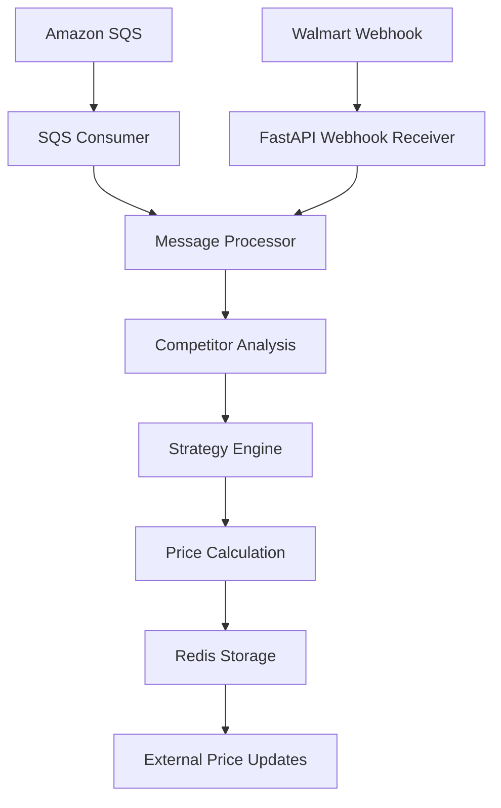

# System Overview

## Architecture Summary

The URepricer system is a high-performance, event-driven repricing engine designed to handle real-time price changes from Amazon and Walmart marketplaces.

## Key Components

### 1. **API Layer (FastAPI)**
- REST API endpoints for management operations
- Webhook receivers for Amazon SQS and Walmart notifications
- Health checks and monitoring endpoints

### 2. **Message Processing Engine**
- Processes Amazon SQS messages and Walmart webhooks
- Extracts competitor pricing data
- Triggers repricing workflows

### 3. **Pricing Strategy Engine**
- Multiple strategy implementations (MaximiseProfit, ChaseBuyBox, OnlySeller)
- Price bounds validation
- B2B tier pricing support

### 4. **Data Storage**
- **Redis**: Product data, strategy configurations, calculated prices
- **PostgreSQL**: Persistent application data (optional)

### 5. **Background Services**
- SQS consumer for Amazon notifications
- Celery workers for async processing
- Periodic tasks via Celery Beat

## Data Flow

## Scaling Characteristics

- **Throughput**: 400-500 messages/second (local), 2000+ messages/second (production)
- **Response Time**: <100ms P50, <300ms P95
- **Horizontal Scaling**: Stateless services, Redis clustering support
- **High Availability**: Multi-region deployment capability