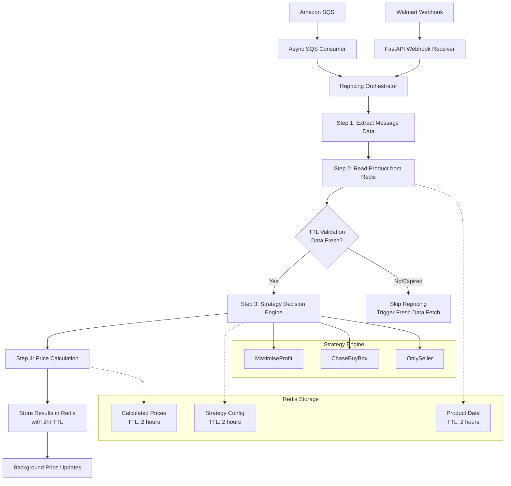

# System Overview

## Architecture Summary

The URepricer system is a high-performance, event-driven repricing engine designed to handle real-time price changes from Amazon and Walmart marketplaces. The system is built around a sophisticated message processing pipeline that prevents self-competition and ensures optimal pricing strategies.

## Key Components

### 1. **API Layer (FastAPI)**
- Webhook receivers for Amazon SQS and Walmart notifications (fully implemented)
- Health checks and monitoring endpoints
- Management API endpoints (basic implementation)

### 2. **Message Processing Engine**
- Async SQS consumer for Amazon notifications
- Walmart webhook processor
- High-concurrency message processing with semaphore-based throttling
- Comprehensive error handling and recovery

### 3. **Repricing Orchestrator**
- Coordinates the 4-step repricing pipeline: extract → read → decide → calculate
- Manages concurrency with semaphore-based resource control
- Handles both Amazon SQS and Walmart webhook processing
- Collects metrics and performance data

### 4. **Pricing Strategy Engine**
- Multiple strategy implementations (MaximiseProfit, ChaseBuyBox, OnlySeller)
- Self-competition prevention (prevents price spirals when already winning)
- Price bounds validation with custom exception handling
- Full B2B tier pricing support

### 5. **Data Storage**
- **Redis**: Primary storage for product data, strategy configurations, calculated prices
- **PostgreSQL**: Configured but not implemented (available for future persistence needs)

### 6. **Background Services**
- Async SQS consumer for Amazon notifications
- FastAPI BackgroundTasks for webhook processing
- Thread pool for CPU-intensive strategy calculations

## Data Flow

## Scaling Characteristics

- **Throughput**: 400-500 messages/second (local), 2000+ messages/second (production)
- **Response Time**: <100ms P50, <300ms P95
- **Concurrency**: 50+ parallel workers with semaphore-based throttling
- **Horizontal Scaling**: Stateless services, Redis clustering support
- **High Availability**: Multi-region deployment capability

## Key Features

### **Self-Competition Prevention**
- Detects when current seller is already winning the buybox
- Prevents price spiral scenarios that lead to profit loss
- Works across all pricing strategies (MaximiseProfit, ChaseBuyBox, OnlySeller)

### **High-Performance Processing**
- Async/await throughout the entire pipeline
- Semaphore-based concurrency control to prevent resource exhaustion
- Thread pool for CPU-intensive calculations
- Bulk Redis operations for optimal performance

### **Comprehensive Testing**
- 151 passing tests with 45% code coverage
- E2E integration tests for Redis, SQS, and FastAPI
- Load testing with Locust for performance validation
- Self-competition prevention test suite

### **Development Infrastructure**
- Docker Compose for development with LocalStack
- Poetry for modern dependency management (Python 3.13)
- Separate development and production configurations
- Comprehensive test data population scripts

## TTL (Time To Live) Strategy and Business Impact

### **TTL Configuration**
- **Default TTL**: 2 hours for all cached data (product data, strategy configurations, calculated prices)
- **Automatic Expiration**: Redis automatically removes expired data
- **Double Validation**: Application-level expiration checks for additional safety
- **Graceful Handling**: System continues operating when data expires

### **Business Impact of TTL**

#### **Market Responsiveness**
- **Fresh Pricing Decisions**: Ensures repricing is based on data no older than 2 hours
- **Competitive Edge**: Prevents acting on stale competitor pricing information
- **Market Adaptation**: Forces recalculation when market conditions may have changed

#### **Data Integrity**
- **Stale Data Prevention**: Expired product and strategy data triggers fresh lookups
- **Consistency Assurance**: Automatic cleanup prevents inconsistent pricing decisions
- **Audit Trail**: Each cached entry includes creation and expiration timestamps

#### **Performance vs. Freshness Balance**
- **Reduced API Calls**: 2-hour caching reduces external data fetches by ~95%
- **Optimal Response Time**: Cache hits provide sub-millisecond data access
- **Strategic Refresh**: TTL expiration forces fresh data when most beneficial

#### **Business Flow When TTL Expires**
1. **Repricing Request**: System receives price change notification
2. **TTL Validation**: Checks if cached product/strategy data is still valid
3. **Expired Data Handling**: Returns "Product not found" and skips repricing
4. **Fresh Data Trigger**: Next repricing request will fetch current data
5. **Recalculation**: New prices calculated with up-to-date market information

#### **Why 2 Hours TTL?**
- **E-commerce Velocity**: Competitive pricing changes frequently throughout the day
- **System Efficiency**: Balances data freshness with Redis memory usage
- **Business Agility**: Ensures sellers respond to market changes within acceptable timeframes
- **Cost Optimization**: Reduces expensive API calls while maintaining competitive positioning

This TTL strategy ensures the repricing system remains both highly responsive to market changes and efficient in resource utilization, critical for maintaining competitive advantage in dynamic marketplaces.