# System Architecture and Data Flow

This document provides a comprehensive overview of the high-throughput repricing system architecture.

## System Overview

The system processes thousands of repricing messages per minute from Amazon SQS and Walmart webhooks through a 4-step pipeline:

1. **Extract message fields** from SQS/webhook notifications
2. **Read product data** from Redis using Redis OM models  
3. **Make repricing decisions** based on business logic with price validation
4. **Apply strategies** and save calculated prices to Redis with seller-first key naming

### Key Architectural Changes (2025 Update)

- **Redis OM Integration**: Migrated from SQLAlchemy to Redis OM (Object Mapper) for all data models
- **Pydantic Price Validation**: Comprehensive model-level validation ensures `min_price <= max_price` 
- **End-to-End Testing**: LocalStack and containerized testing infrastructure for complete workflow validation
- **FastAPI Webhook Endpoints**: High-performance async endpoints for Walmart integration
- **Seller-First Key Naming**: Redis keys organized by seller for efficient data access patterns

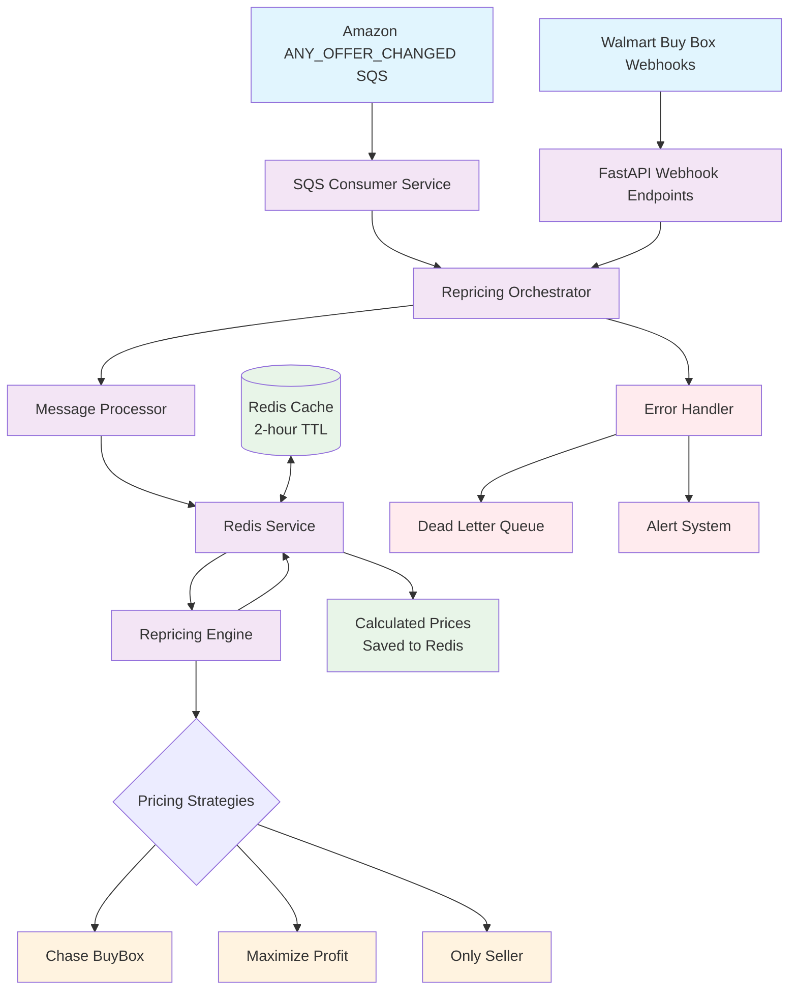

## High-Level Architecture Components

### 1. Message Ingestion Layer
- **SQS Consumer**: Polls Amazon SQS queues for ANY_OFFER_CHANGED notifications with high concurrency
- **FastAPI Webhooks**: Async HTTP endpoints for Walmart buy box change notifications  
- **Message Processor**: Normalizes and validates incoming messages from both platforms

### 2. Data Model Layer (Redis OM)
- **ProductListing**: Redis OM JsonModel for product data with comprehensive price validation
- **B2BTier**: EmbeddedJsonModel for B2B tier pricing with nested validation
- **Price Validation**: Pydantic validators ensure data integrity at model level
- **Seller-First Keys**: Redis keys structured as `listing:{seller_id}:{asin}` for efficient access

### 3. Core Processing Engine
- **Repricing Orchestrator**: Coordinates the entire 4-step pipeline with high concurrency
- **Redis Service**: Handles all data access with connection pooling and TTL management
- **Repricing Engine**: Makes business decisions and applies pricing strategies with bounds checking

### 4. Strategy Layer  
- **Chase BuyBox**: Competes to win the buy box by beating competitor prices
- **Maximize Profit**: Optimizes for profit when already winning buy box
- **Only Seller**: Handles scenarios with no competition, uses mean pricing when needed
- **Price Bounds Validation**: All strategies validate calculated prices against min/max bounds

### 5. Error Handling & Reliability
- **Error Handler**: Comprehensive error classification and handling
- **Dead Letter Queue**: Stores failed messages for manual review
- **Circuit Breaker**: Protects against cascading failures
- **PriceBoundsError**: Custom exceptions for price validation failures

### 6. Testing Infrastructure
- **LocalStack Integration**: SQS and SNS emulation for end-to-end testing
- **Redis Test Instance**: Isolated Redis instance on port 6380 for testing
- **FastAPI TestClient**: Direct endpoint testing with background task verification
- **E2E Test Suite**: Complete workflow tests from webhook/SQS → Redis price updates

## Detailed Data Flow

### Amazon SQS Processing Flow

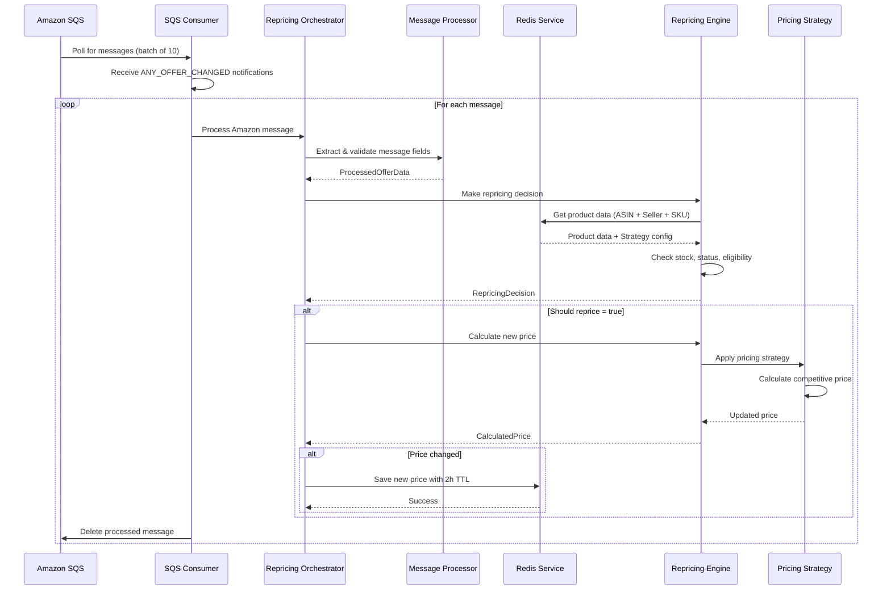

### Walmart Webhook Processing Flow

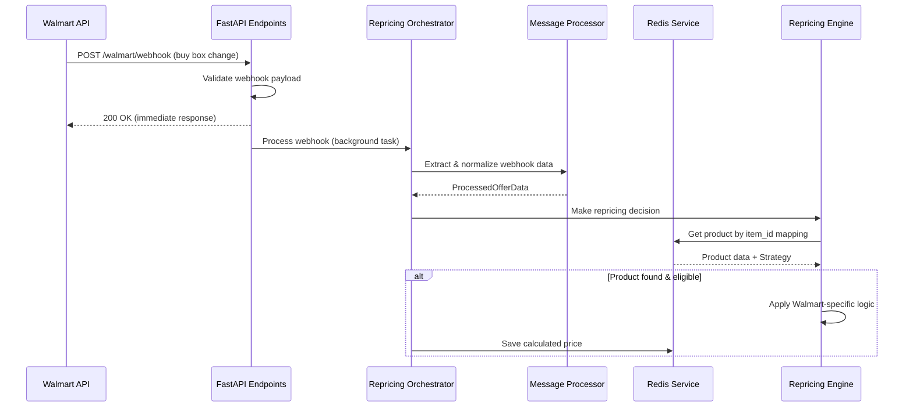

## Redis Data Architecture

### Data Organization Strategy
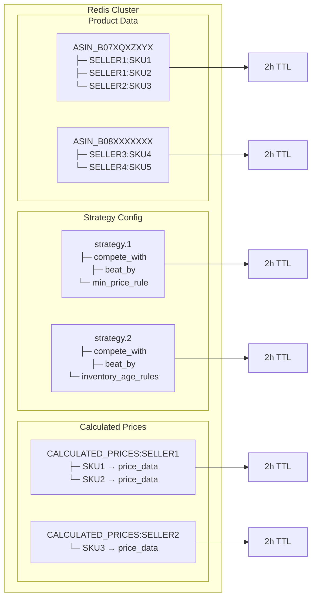

### Connection Pooling & Performance
- **Connection Pool Size**: 20 connections maximum
- **Pipeline Operations**: Batch Redis commands for efficiency
- **Async Operations**: All Redis calls are non-blocking
- **Retry Logic**: Built-in connection retry with exponential backoff

## Concurrency and Throughput Design

### High-Throughput Processing Model
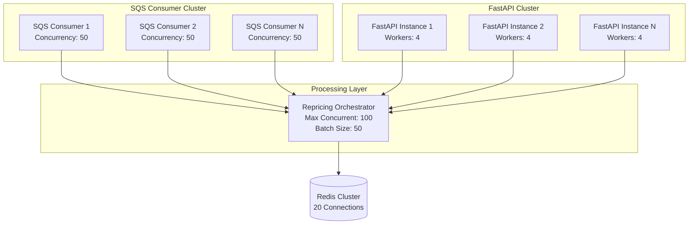

### Performance Characteristics
- **Target Throughput**: 1,000+ messages per minute
- **Average Processing Time**: ~125ms per message
- **Concurrent Message Processing**: Up to 100 messages simultaneously
- **Batch Processing**: Groups messages for efficiency
- **Memory Usage**: Optimized for minimal memory footprint

## Error Handling and Reliability

### Error Classification System
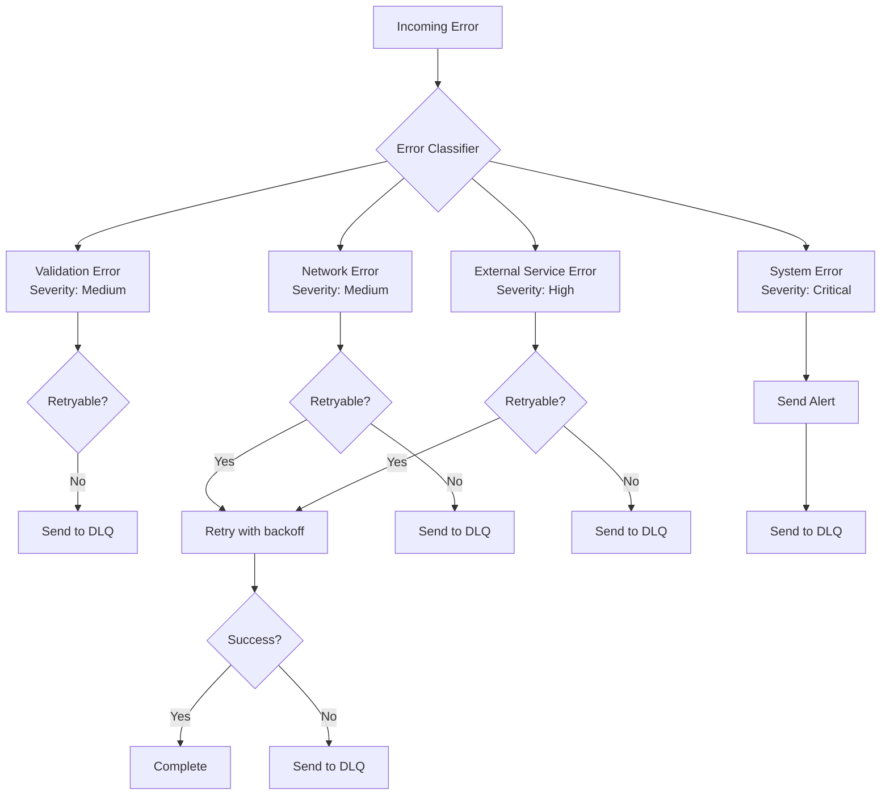

### Circuit Breaker Pattern
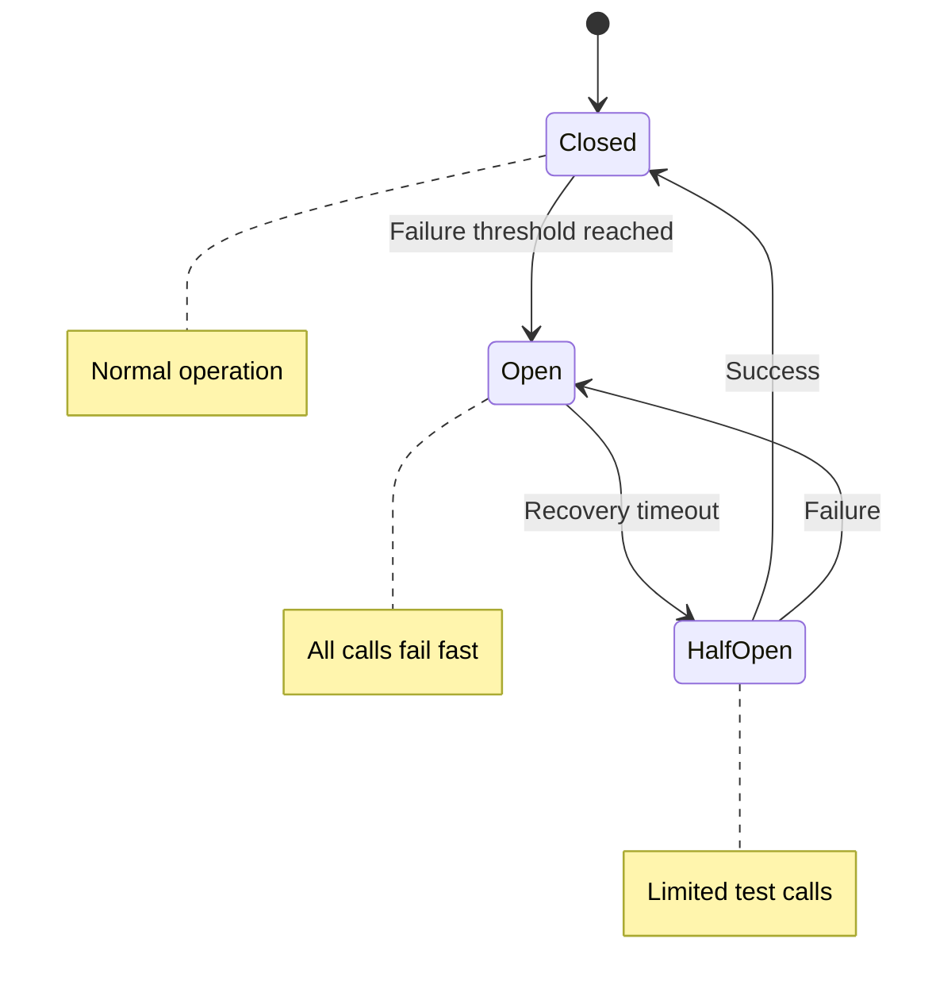

## Strategy Processing Architecture

### Strategy Selection Logic
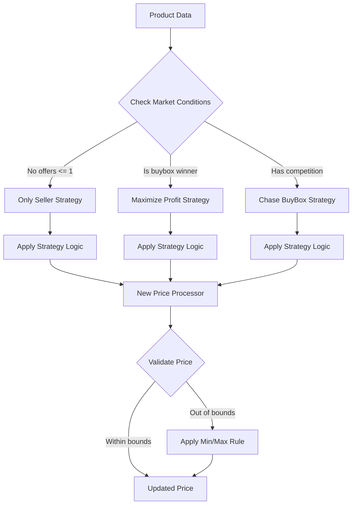

### B2B Tier Processing
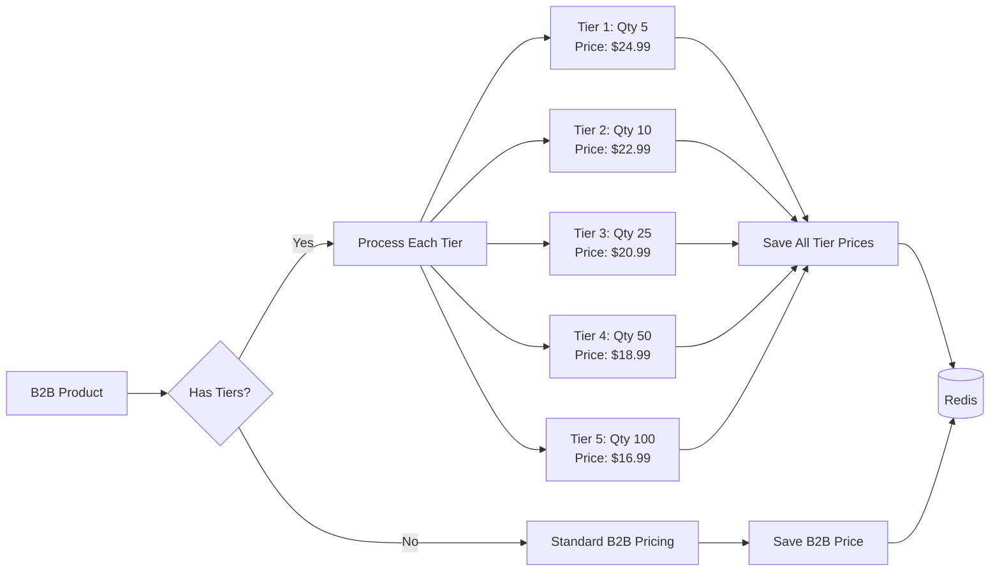

## Monitoring and Health Checks

### System Health Monitoring
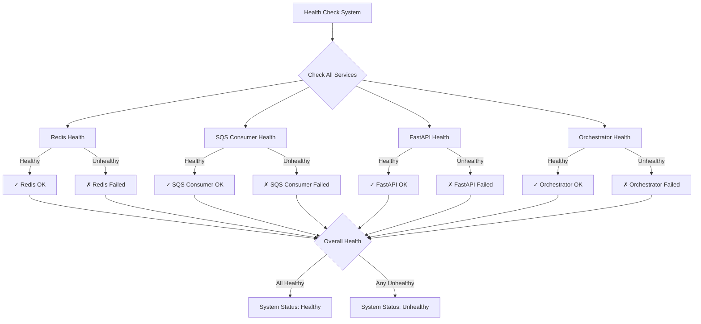

### Performance Metrics Dashboard
- **Messages processed per minute**
- **Average processing time**
- **Success rate percentage**
- **Error rates by category**
- **Redis connection pool usage**
- **Memory and CPU utilization**

## Deployment Architecture

### Production Deployment Model
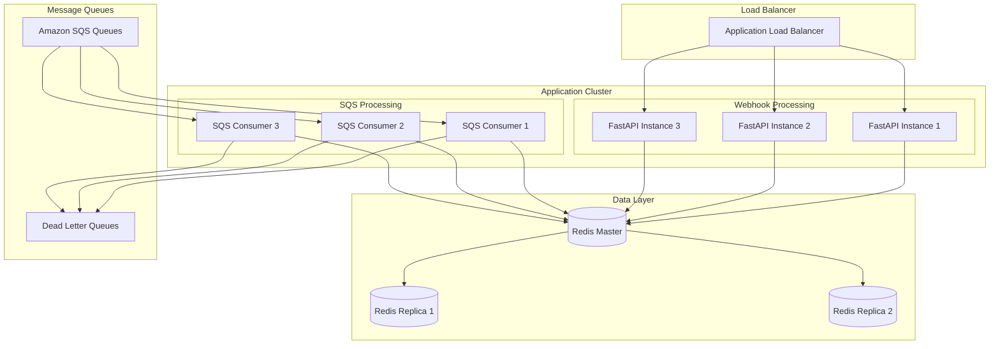

## Security Considerations

### Data Protection
- **Redis Authentication**: Password-protected Redis instances
- **AWS IAM**: Proper IAM roles for SQS access
- **API Authentication**: Webhook endpoint authentication
- **Data Encryption**: TLS for all data in transit

### Rate Limiting
- **API Rate Limits**: Per-client request limits
- **SQS Throttling**: Configurable message processing rates  
- **Redis Connection Limits**: Prevent connection pool exhaustion

## Scalability Design

### Horizontal Scaling Points
1. **FastAPI Instances**: Add more webhook processing servers
2. **SQS Consumers**: Increase number of consumer processes
3. **Redis Cluster**: Shard data across multiple Redis nodes
4. **Load Balancers**: Distribute traffic across instances

### Auto-Scaling Triggers
- **CPU Utilization** > 70%
- **Memory Usage** > 80%  
- **Queue Depth** > 1000 messages
- **Error Rate** > 5%

This architecture supports thousands of messages per minute with high reliability, comprehensive error handling, and horizontal scalability.